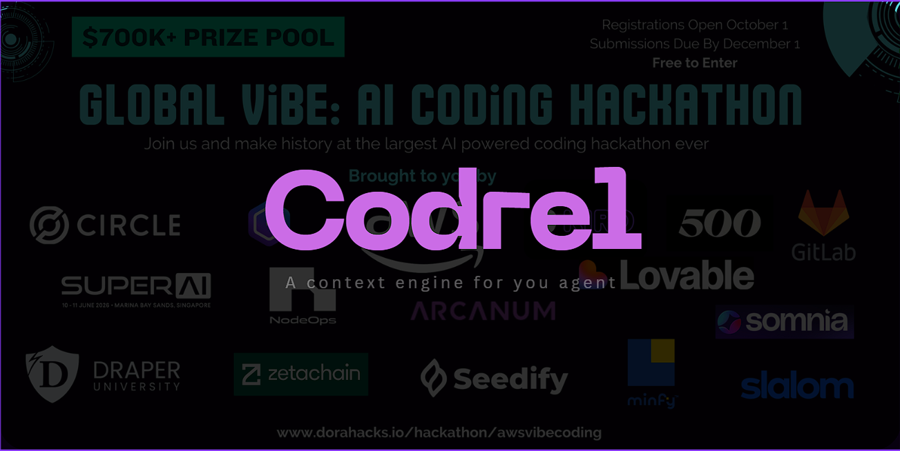
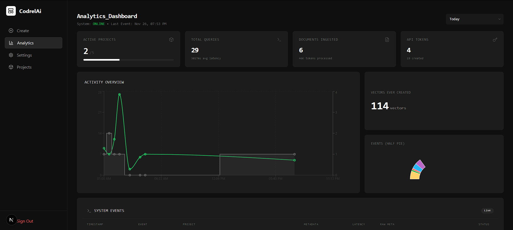
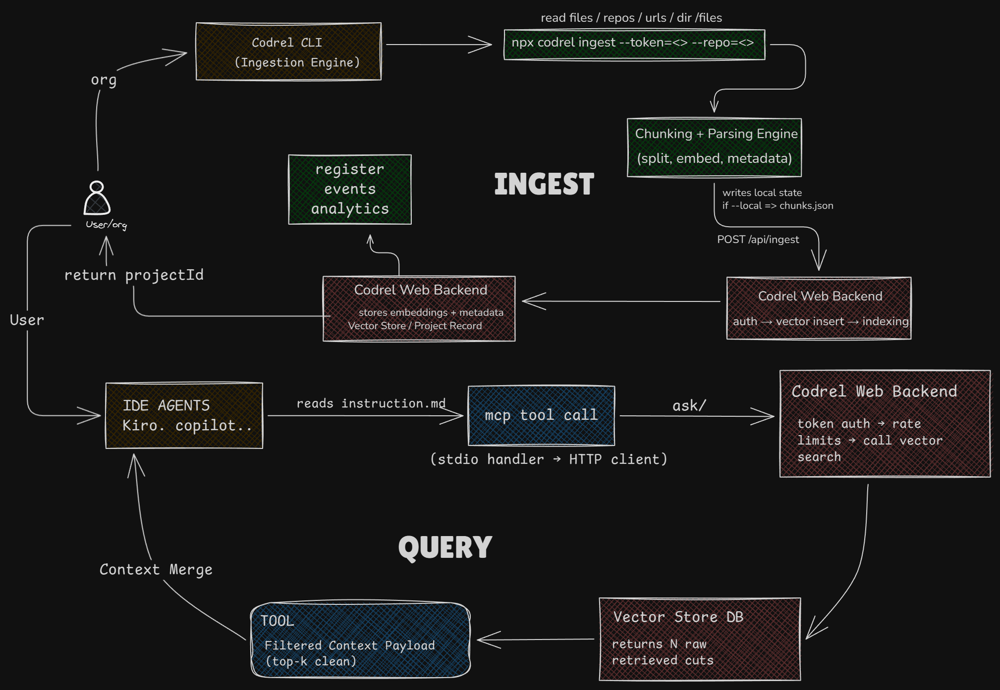
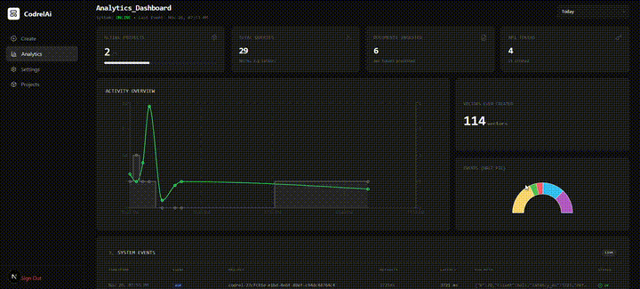
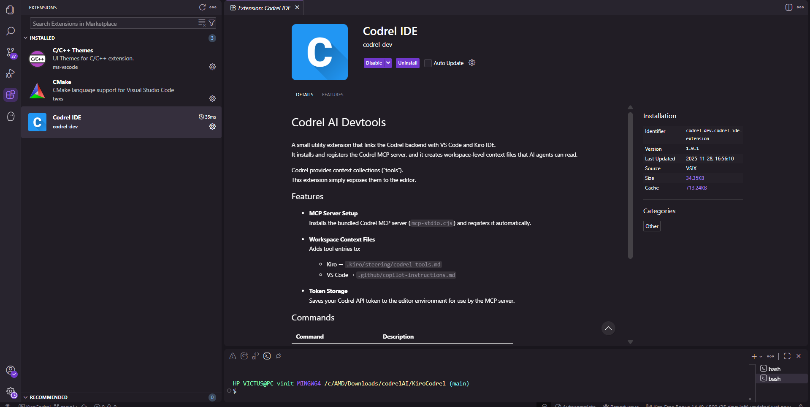

# **Codrel AI**



Codrel is a full-stack system for generating, structuring, and serving **RAG-ready context** to every tool a developer uses.
It ingest documents, URLs, repos, and directories through a CLI, produces structured context, and exposes it to IDEs and agents through MCP, APIs, and a web dashboard.

A single pipeline:
**Your data → Codrel ingestion → structured context → usable everywhere.**

---

## **✨ Overview**



Codrel solves the core problem:
AI assistants don’t know your project — Codrel gives them context.

* ingest anything → CLI
* create `.codrel` knowledge state
* explore/manage → Web (Next.js)
* serve structured context → API
* plug into editors → MCP server
* access instantly → VS Code/Kiro extension

Codrel makes every coding environment context-aware.

---

## **📂 Repository Structure**

```
apps/
  codrel-ide-extension/   → VS Code + Kiro extension
  codrel-mcp/             → MCP Server (stdio)
  web/                    → Next.js dashboard + API routes

packages/
  cli/                    → Codrel CLI (RAG ingestion engine)
  shared/                 → Shared logic + types
  ui/                     → Shared UI components
  eslint-config/          → Shared lint config
  typescript-config/      → Shared tsconfig
```

---

## **🧠 What Codrel Does**

Codrel takes scattered knowledge from your project and turns it into structured context usable by AI agents.

### The CLI ingests:

* documents
* URLs
* repositories
* directories
* files
* entire API sources

### Example CLI pattern

```
npx codrel ingest \
  --token=<token> \
  --documentToIngest <path|url> \
  --support \
  --repo <github-url> \
  --dir <folder> \
  --files <file1,file2,...>
  --sitemap <yml> \
  --pattern <pattern or sitemap>
```

This writes the `.codrel` knowledge state:

```
.cordel/
  chunks.json
  meta.json
  state.json
  wholecontext.json
```

This becomes the **source of truth** for all other components.

---

## **🖥 Architecture**


---

## **🧩 Component Breakdown**

### **1. Codrel CLI (packages/cli)**

The heart of Codrel.
Builds the entire RAG context using ingestion pipelines, orchestration logic, and the internal `.codrel` engine.

### **2. Codrel Web (apps/web)**

Next.js dashboard + backend:

* visualize context
* manage collections & auth
* serve ingestion results to MCP
* dashboard for end-users



### **3. Codrel MCP Server (apps/codrel-mcp)**

Standard MCP implementation over stdio.
Acts as the interpreter layer between editors and the Codrel Web API.

### **4. Codrel IDE Extension (apps/codrel-ide-extension)**

Brings Codrel into VS Code and Kiro IDE:

* handles MCP server lifecycle
* stores Codrel token
* writes workspace context

  * Kiro → `.kiro/steering/codrel-tools.md`
  * VS Code → `.github/copilot-instructions.md`
* exposes commands for adding collections/tools

<!--  -->

### **5. Shared Packages**

* `shared/` → common logic/types/state
* `ui/` → dashboard UI components
* `eslint-config/` + `typescript-config/` → monorepo dev standards

---

## **🔗 How It All Works Together**

Codrel allows every part of your workflow to access the same structured context:

| Layer         | Purpose                                      |
| ------------- | -------------------------------------------- |
| **CLI**       | Ingest data → build `.codrel`                |
| **Web**       | View/manage context + expose backend API     |
| **MCP**       | Translate editor requests → Codrel responses |
| **Extension** | Provide workspace tools + MCP integration    |

---

## **🎯 In One Line**

Codrel turns your real project knowledge into structured, always-available context —
and feeds it into any AI-powered development workflow.

---